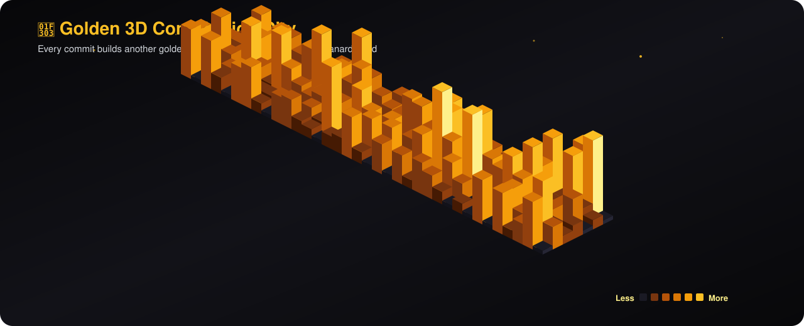

<!-- 🎬 HERO — animated intro + name + cycling roles -->

  

<!-- 👨‍💻 LEFT: what I build   •   🏃 RIGHT: life beyond code -->

  

<!-- ⚡ TECH STACK -->

  

<!-- 🪪 DEVELOPER ID + DASHBOARD -->

  

## 🎯 Featured Projects

| Project | Description | Stack | Link |
|:---|:---|:---|:---:|
| [**Finance Manager**](https://github.com/janardhan-d/finance-manager-innobyte-services) | Full-featured personal finance manager with login, dashboards, budgeting & backup/restore — built during InnoByte Services internship | `Python` `Analytics` | [🔗](https://github.com/janardhan-d/finance-manager-innobyte-services) |
| [**CareerPilot**](https://github.com/janardhan-d/careerPilot) | AI-powered career guidance platform | `Python` `ML` `AI` | [🔗](https://github.com/janardhan-d/careerPilot) |
| [**AI Quiz Platform**](https://github.com/janardhan-d/ai-quiz-platform) | Smart quiz application with AI-driven question generation | `JavaScript` `AI` | [🔗](https://github.com/janardhan-d/ai-quiz-platform) |
| [**Kanban Board**](https://github.com/janardhan-d/Syntecxhub_KanbanBoard) | Interactive animated task management board showcasing UI/UX & problem-solving | `HTML` `CSS` `JavaScript` | [🔗](https://github.com/janardhan-d/Syntecxhub_KanbanBoard) |
| [**JPMC Forage Simulation**](https://github.com/janardhan-d/forage-midas) | Advanced Software Engineering virtual experience with JP Morgan Chase | `Data` `Engineering` | [🔗](https://github.com/janardhan-d/forage-midas) |
| [**3D Space Portfolio**](https://github.com/janardhan-d/Portfolio) | Immersive space-themed portfolio with 3D animations | `JavaScript` `Next.js` `Three.js` | [🔗](https://github.com/janardhan-d/Portfolio) |

 

## 📊 GitHub Stats

&nbsp;&nbsp;

  

  

## 🌃 My Contribution City

*Every commit builds another tower — watch the city grow.*

  

<!-- 💌 LET'S CONNECT -->

  

 

**Always learning, always building.** 💜

